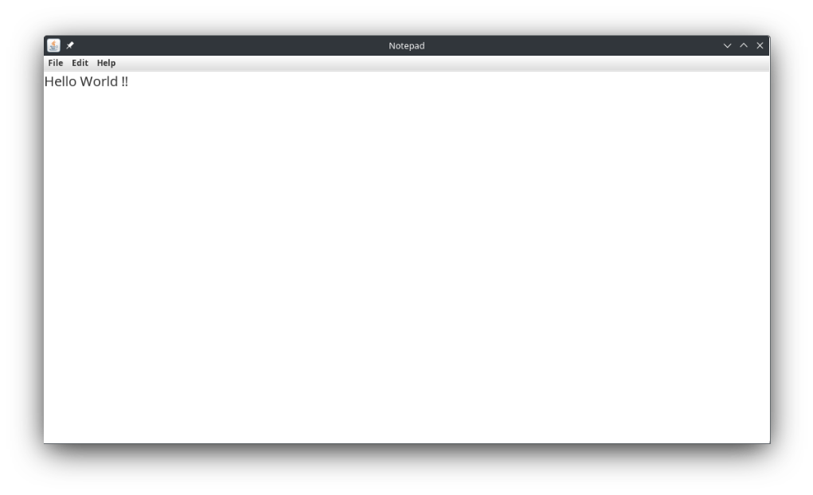

# Notepad

A simple Java-based Notepad application with essential text editing features. This application provides a basic graphical user interface (GUI) for text editing and file management.



## Features

- **New**: Create a new document.
- **Open**: Open an existing `.txt` file.
- **Save**: Save the current document as a `.txt` file.
- **Print**: Print the content of the document.
- **Exit**: Exit the application.
- **Copy**: Copy selected text to the clipboard.
- **Paste**: Paste text from the clipboard.
- **Cut**: Cut selected text and place it on the clipboard.
- **Select All**: Select all text in the document.
- **About Notepad**: Display information about the application.

## Requirements

- Java Development Kit (JDK) 8 or higher

## How to Run

1. **Clone the Repository**

   First, clone the repository to your local machine:

   ```bash
   git clone https://github.com/hari-shadow/Notepad.git
   ```
   Navigate into the project directory:

   ```bash
   cd Notepad
   ```
2. **Compile the Code**

   Ensure you have the JDK installed. Compile the Java code using the javac command:

   ```bash
   javac notepad/Notepad.java
   ```
   This command compiles the Java source file and places the compiled .class files in the current directory.

3. **Run the Application**

   Execute the compiled Notepad class with the java command:

   ```bash
   java notepad.Notepad
   ```
   This command will launch the Notepad application.
